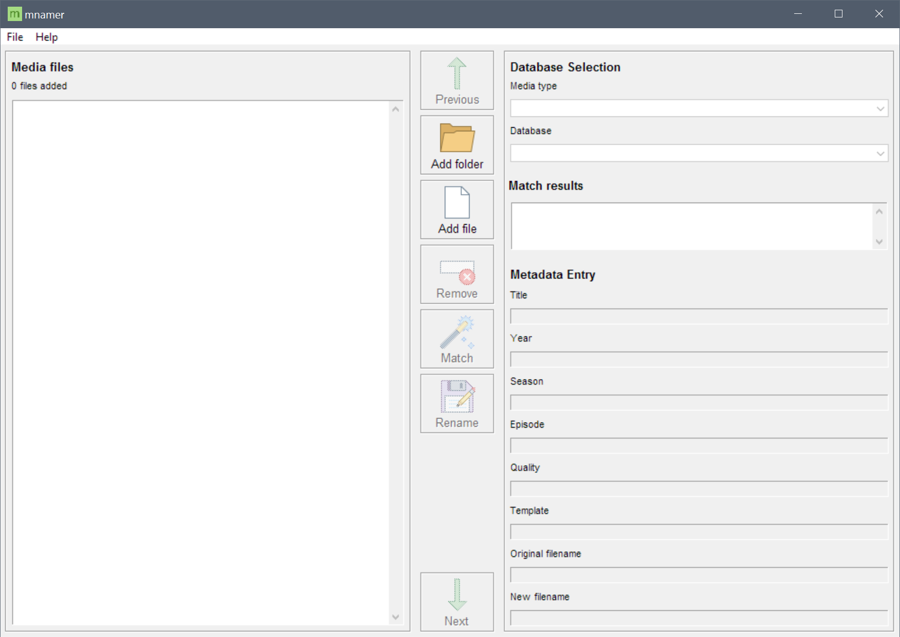

mnamer
======

.. image:: _images/mnamer.png

``mnamer`` is a media file renaming utility. It can be used to organize movie and television files either interteractively or in batch via either a graphical user interface (GUI) or command line interface (CLI). It is cross-platform, running on using python 3.6+.

Check out the `wiki <https://github.com/jkwill87/mnamer/wiki>`_ for comprehensive documentation, usage examples, and more.

GUI Interface
=============

CLI Usage
=========

.. parsed-literal::
    mnamer  [--tv I [I ...]] [--tvdest D] [--tvtemplate T]
            [--movie I [I ...]] [--movie D] [--movietemplate T]
            [--extmask E [E ...]] [--saveconfig [C]] [--loadconfig C]
            [-h] [-b] [-p] [-c] [-g]

    a media file renaming utility

    optional arguments:
      -h, --help           show this help message and exit
      --tv I [I ...]       television files and/or directories
      --tvdest D           moves renamed television files to location if set
      --tvtemplate T       television file renaming template
      --movie I [I ...]    movie files and/or directories
      --moviedest D        moves renamed movie files to location if set
      --movietemplate T    movie file renaming template
      --extmask E [E ...]  define the extension mask used by the the file parser
      --saveconfig [C]     save current config settings to file; dafaults to ~/.mnamer.cfg
      --loadconfig [C]     load settings from config file
      -r                   recursive file crawling and following symlinks
      -b                   batch mode; disables interactive prompts and persists on error
      -p                   preview mode; printout config and run w/o changes to disk
      -c                   use colour terminal escape sequences
      -g                   gui mode
